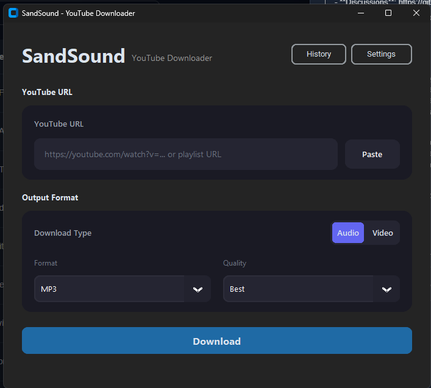
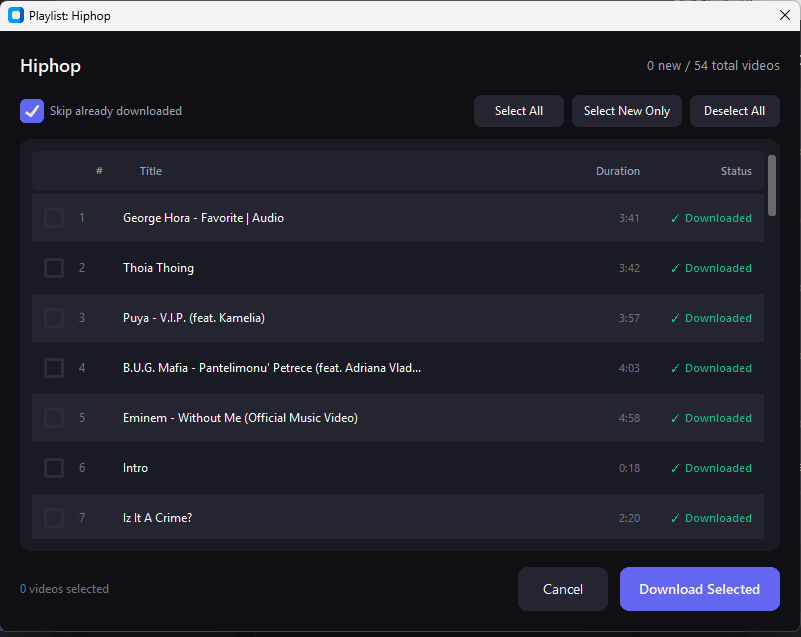
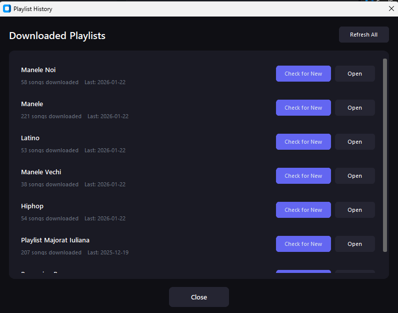

# SandSound

<div align="center">


**A modern, open-source YouTube downloader for audio, music, and video downloads**

Perfect for musicians, content creators, and anyone who needs a reliable YouTube downloader.

> **Note**: SandSound is a GUI wrapper built on top of [yt-dlp](https://github.com/yt-dlp/yt-dlp), adding features like download history tracking, playlist management, smart re-download detection, and a modern desktop interface. All core downloading functionality is powered by yt-dlp.

[Features](#-features) - [Installation](#-installation) - [Usage](#-usage) - [Changelog](#changelog) - [Contributing](#-contributing) - [License](#-license)

</div>

---

<div align="center">

**Topics**: `youtube-downloader` - `audio` - `music` - `open-source` - `cli-tool` - `yt-dlp` - `musicians` - `youtube` - `downloader` - `mp3` - `playlist` - `python` - `desktop-app` - `gui` - `customtkinter`

</div>

---

## Overview

SandSound is a modern, open-source desktop application for downloading YouTube videos and audio. Perfect for musicians, content creators, and anyone who needs to download YouTube content. Built with Python and CustomTkinter, it provides a clean, intuitive interface that makes downloading content simple and enjoyable.

**Key Features for Musicians & Audio Enthusiasts:**
- High-quality audio extraction (MP3, M4A, OPUS, FLAC, WAV)
- Batch playlist downloads for entire music collections
- Smart re-download detection to keep your library updated
- Clean, distraction-free interface focused on the essentials

### Why SandSound?

- **Modern UI** - Beautiful dark theme interface that doesn't look like it's from 2005
- **Playlist Management** - Smart playlist handling with visual progress tracking
- **Concurrent Downloads** - Download multiple files simultaneously
- **Cookie Support** - Easy authentication for age-restricted content
- **Cross-Platform** - Works on Windows, Linux, and macOS
- **Open Source** - Free, open-source, and community-driven

## Features

### Core Functionality
- **Audio & Video Downloads** - Support for MP3, M4A, OPUS, FLAC, WAV, MP4, WebM, MKV
- **Playlist Support** - Visual table view showing each video with download status
- **Smart Re-download** - Automatically detects and downloads only new videos from playlists
- **Cookie Authentication** - Paste cookies directly for accessing age-restricted content
- **Download History** - Persistent SQLite tracking of downloaded content with playlist management
- **Concurrent Downloads** - Download up to 4 files simultaneously for faster processing

### User Experience
- **Modern Dark UI** - Clean, premium design built with CustomTkinter
- **Intuitive Interface** - Easy-to-use controls with clear visual feedback
- **Format Selection** - Choose from multiple audio/video formats and quality settings
- **Progress Tracking** - Real-time progress updates with speed and ETA information
- **Customizable Settings** - Configure download directory, FFmpeg path, and more

## Changelog

Project history is tracked in [CHANGELOG.md](CHANGELOG.md).

### Latest Release: v1.0.5

- Added SQLite-backed persistence for download history and metadata caching.
- Added automatic migration from legacy `download_history.json` into `sandsound.db` with backup preservation.
- Added playlist/dialog performance improvements and async UI helper utilities.
- Added configurable concurrent downloads in Settings (bounded between 1 and 8).
- Added download cancellation controls for single and playlist downloads.
- Added automated unit tests and CI test execution in the release workflow.
- Improved PyInstaller packaging hooks/import discovery for more reliable builds.
- Updated runtime guidance for yt-dlp JavaScript runtime requirements.

## Screenshots

### Main Interface


### Playlist View


### Download History


## Requirements

- **Python** 3.10 or higher
- **FFmpeg** (for audio/video conversion)
  - Can be installed system-wide or configured in app settings
- **Operating System**: Windows, Linux, or macOS
- **Deno (optional, recommended for YouTube)**  
  - Recent yt-dlp versions use a JavaScript runtime for full YouTube support. Installing Deno reduces "No supported JavaScript runtime" warnings and can avoid 403/signature issues.  
  - **Windows**: `winget install --id=DenoLand.Deno`  
  - **Linux/macOS**: See [deno.land](https://deno.land) or your package manager.  
  - If Deno is on your PATH, yt-dlp will use it automatically.

## Installation

### Option 1: Pre-built Executable (Windows)

1. Download the latest release from the [Releases page](https://github.com/Nasapan23/sandsound/releases)
2. Run `SandSound-Windows-X.X.X.exe`
3. Ensure FFmpeg is installed (see [FFmpeg Setup](#ffmpeg-setup))

### Option 2: From Source

#### Prerequisites

Make sure you have Python 3.10+ installed:

```bash
python --version  # Should be 3.10 or higher
```

#### Installation Steps

1. **Clone the repository**
   ```bash
   git clone https://github.com/Nasapan23/sandsound.git
   cd sandsound
   ```

2. **Create a virtual environment** (recommended)
   ```bash
   # Windows
   python -m venv venv
   venv\Scripts\activate
   
   # Linux/macOS
   python3 -m venv venv
   source venv/bin/activate
   ```

3. **Install dependencies**
   ```bash
   pip install -r requirements.txt
   ```

4. **Run the application**
   ```bash
   cd src
   python main.py
   ```

### FFmpeg Setup

FFmpeg is required for audio conversion. You have two options:

1. **System-wide installation** (recommended)
   - Download from [ffmpeg.org](https://ffmpeg.org/download.html)
   - Add to your system PATH
   - The app will auto-detect it

2. **Manual configuration**
   - Download FFmpeg
   - Open SandSound Settings
   - Point to the FFmpeg executable location

## Usage

### Basic Usage

1. Launch SandSound
2. Paste a YouTube URL (video or playlist) into the input field
3. Select your preferred format and quality
4. Click "Download" or press Enter

### Playlist Downloads

1. Paste a playlist URL
2. The playlist bar will appear showing playlist information
3. Click "View Playlist" to see all videos
4. Select which videos to download
5. Click "Download Selected"

### Settings

Access settings via the Settings button in the top-right:
- Configure download directory
- Set FFmpeg path
- Manage cookie file
- Adjust concurrent downloads for playlist performance
- Adjust theme preferences

## Configuration

SandSound stores its local data in `~/.sandsound/` (or `%USERPROFILE%\.sandsound\` on Windows):

- `config.json` - Application settings (download directory, theme, etc.)
- `cookies.txt` - YouTube cookies for authentication
- `sandsound.db` - Auto-created SQLite database for download history and metadata cache
- `download_history.json.bak` - Preserved backup created automatically after first-run migration from older JSON history files

Playlist and video metadata is cached in the same SQLite database so playlist detection and reopen flows are faster. Fresh playlist checks still force a live refresh before comparing for new videos.

## Troubleshooting

### Common Issues

**FFmpeg not found**
- Ensure FFmpeg is installed and in your PATH, or configure the path in Settings

**Downloads fail or are slow**
- Check your internet connection
- Some videos may require cookies for authentication (add in Settings)
- Try a different format or quality setting
- If you see "No supported JavaScript runtime" or 403/rate-limit errors: install Deno (see [Requirements](#requirements)) and/or reduce concurrent downloads in Settings to avoid YouTube rate limiting

**Playlist button doesn't appear**
- Ensure the URL is a valid YouTube playlist
- Check that the playlist is public or you have proper authentication

**Application won't start**
- Verify Python 3.10+ is installed
- Check that all dependencies are installed: `pip install -r requirements.txt`
- Review error messages in the console

### Getting Help

- Check existing [Issues](https://github.com/Nasapan23/sandsound/issues)
- Create a new [Issue](https://github.com/Nasapan23/sandsound/issues/new) with details
- Review the [Contributing Guide](CONTRIBUTING.md) for development help

## Roadmap

### Planned Features
- Thumbnail embedding in audio files
- Audio normalization
- Scheduled downloads
- Multi-language support
- System tray integration
- Download notifications

### Completed Features
- Concurrent downloads
- Download queue management
- Playlist history tracking
- Smart re-download detection

## Contributing

We welcome contributions! SandSound is an open-source project, and we appreciate any help you can provide.

Please read our [Contributing Guide](CONTRIBUTING.md) for details on:
- How to report bugs
- How to suggest features
- Development setup
- Code style guidelines
- Pull request process

### Quick Contribution Steps

1. Fork the repository
2. Create a feature branch (`git checkout -b feature/amazing-feature`)
3. Make your changes
4. Commit with clear messages (`git commit -m 'Add amazing feature'`)
5. Push to your branch (`git push origin feature/amazing-feature`)
6. Open a Pull Request

See [CONTRIBUTING.md](CONTRIBUTING.md) for more details.

## License

This project is licensed under the MIT License - see the [LICENSE](LICENSE) file for details.

## Acknowledgments

- **[yt-dlp](https://github.com/yt-dlp/yt-dlp)** - The powerful YouTube downloader library that makes this possible
- **[CustomTkinter](https://github.com/TomSchimansky/CustomTkinter)** - Beautiful modern UI components
- **[Pillow](https://python-pillow.org/)** - Image processing support
- All contributors and users who help improve SandSound

## Contact & Support

- **Issues**: [GitHub Issues](https://github.com/Nasapan23/sandsound/issues)
- **Discussions**: [GitHub Discussions](https://github.com/Nasapan23/sandsound/discussions)

## Topics & Keywords

This project is tagged with the following topics for easy discovery:

**Primary Topics:**
- `youtube-downloader` - Download videos and audio from YouTube
- `audio` - High-quality audio extraction and conversion
- `music` - Perfect for musicians and music enthusiasts
- `open-source` - Free and open-source software
- `cli-tool` - Command-line interface support (planned)
- `yt-dlp` - Built on the powerful yt-dlp library
- `musicians` - Designed with musicians in mind

**Additional Tags:**
- `youtube` - `downloader` - `mp3` - `playlist` - `python` - `desktop-app` - `gui` - `customtkinter` - `video-downloader` - `audio-extractor` - `batch-download` - `playlist-manager`

> **Note**: To add these topics to your GitHub repository, go to the repository page -> click the gear icon next to "About" -> add topics in the "Topics" field.

---

<div align="center">

**Crafted by the SandSound community - primary maintainer: Nisipeanu Ionut**

Star this repo if you find it useful!

</div>

